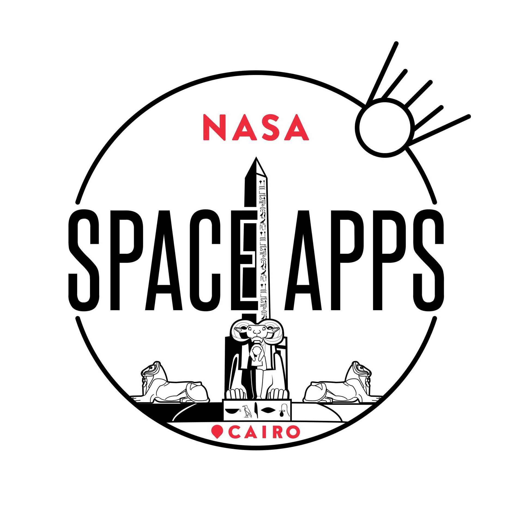

 
 
 
 
 
 
 

# Eye of The Universe

## Table of contents

- [Overview](#overview)
- [Stations](#stations)
  - [Discovery Station](#discovery-station)
  - [Puzzle Station](#puzzle-station)
  - [Flipped Cards Station](#flipped-cards)
  - [PSF Station](#psf-station)
- [Future Features](#future-features)
- [Technologies](#technologies)
- [Team](#team)

## Overview

This project is a solution for `Learning Through the Looking Glass` challenge which is to develop a game to help people learn about the `James Webb Space Telescope`’s amazing capabilities.

 

> Our game is divided into 4 stations: Discovery, Puzzle Game, Memory Game and PSF, and 5 levels, each level has a new image captured by James Web Telescope to be opened to the player to play with it in the stations.

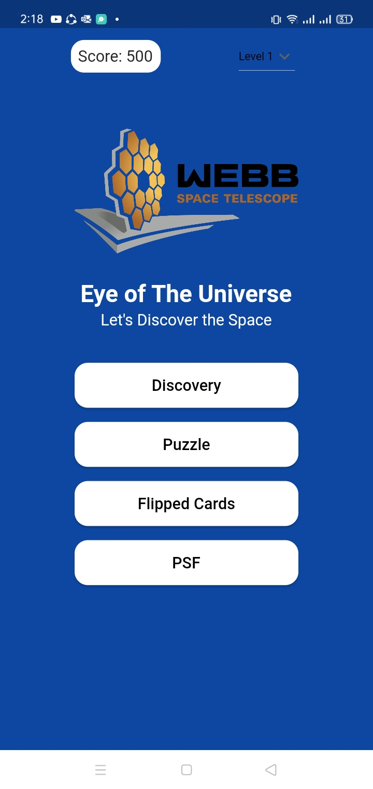 

 

## Stations

> ### Discovery Station

- Player discovers an object in space using James Webb Telescope and Hubble Telescope, comparing the capabilities of the two telescopes.

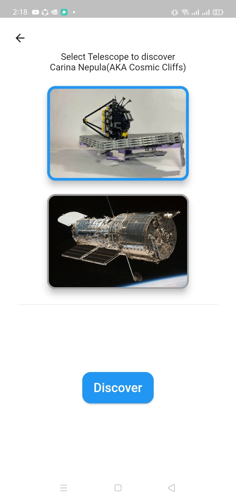  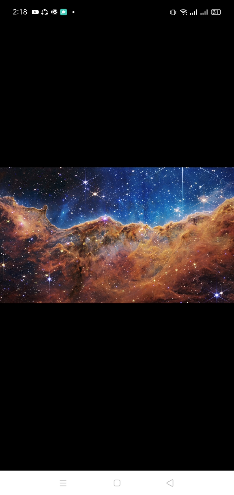

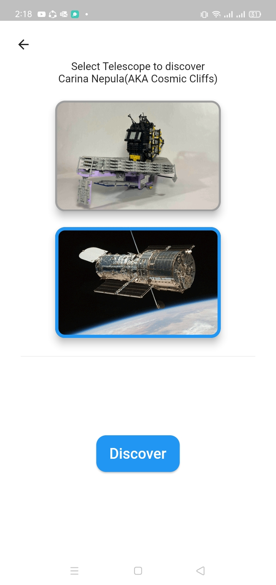  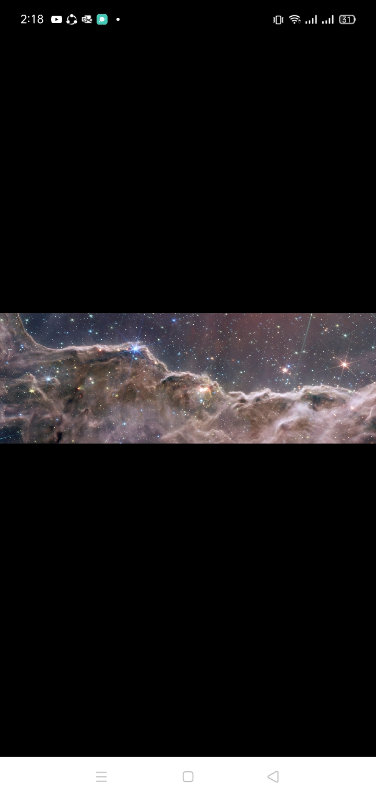

> ### Puzzle Station

- It's a puzzle game with a gradual difficulty ending by new information about the formatted image of an object.

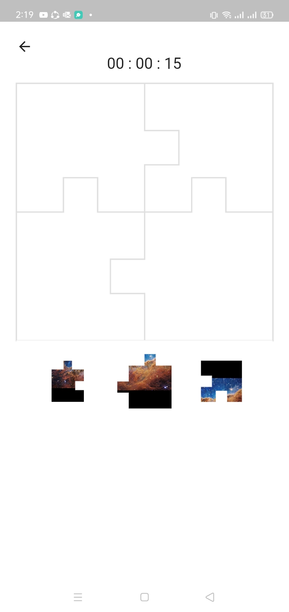 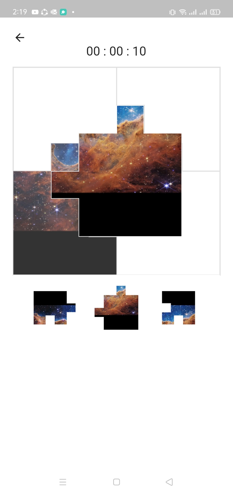 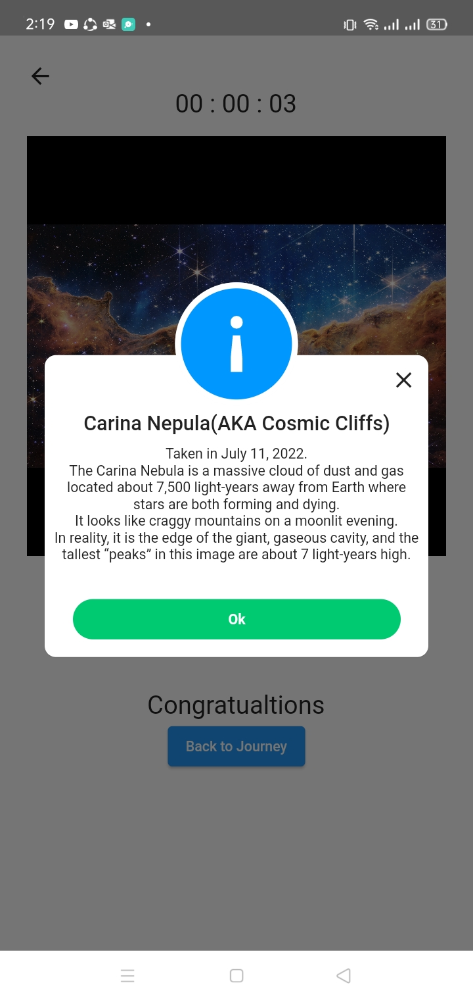

> ### Flipped Cards Station

- It's a memory game of flipped cards of images of James Webb instruments with a gradual difficulty displaying information about the matched instrument images.

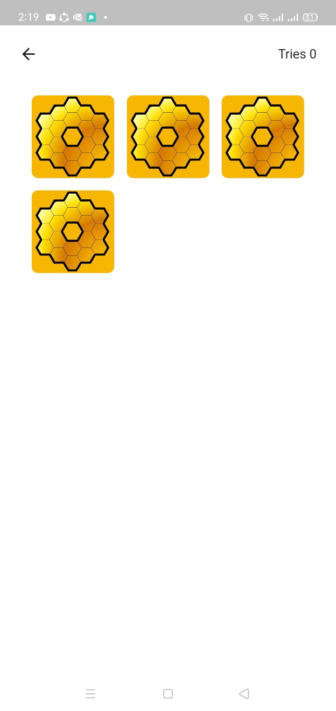 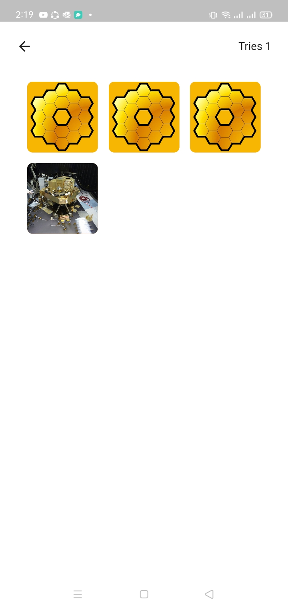 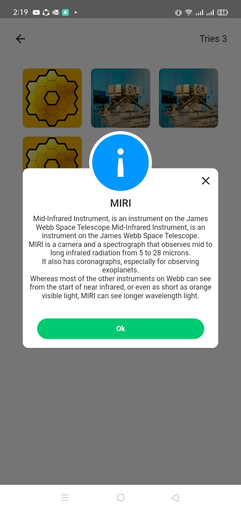 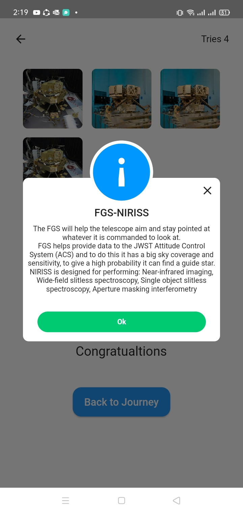 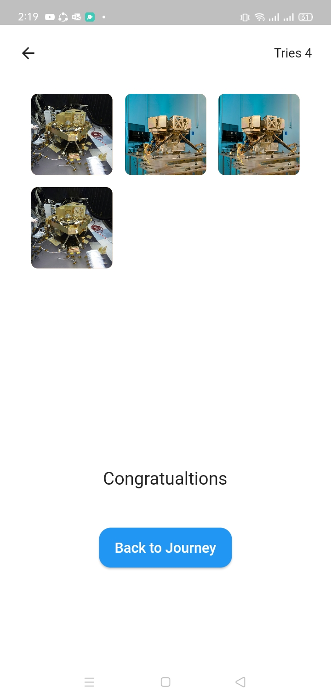

> ### PSF Station

- It's a customization in James webb instruments and filters, then the player see the result image.

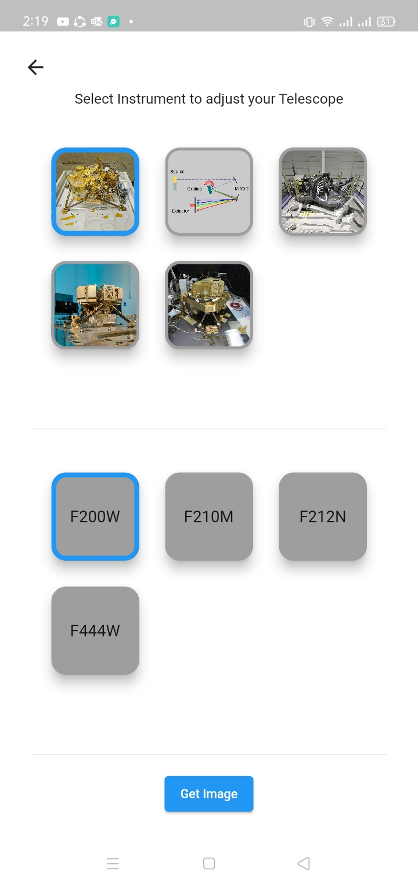  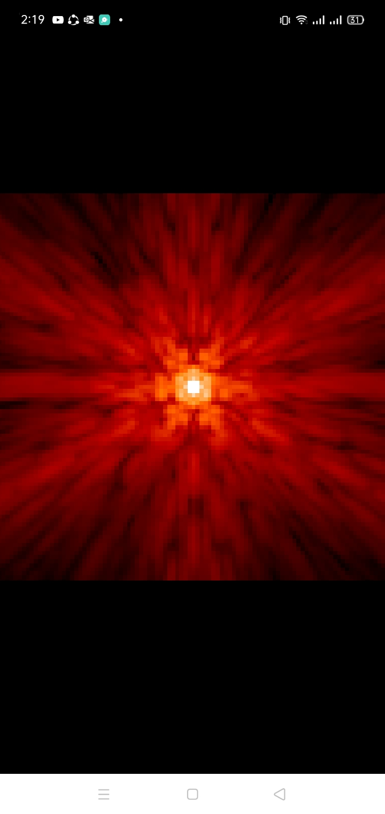

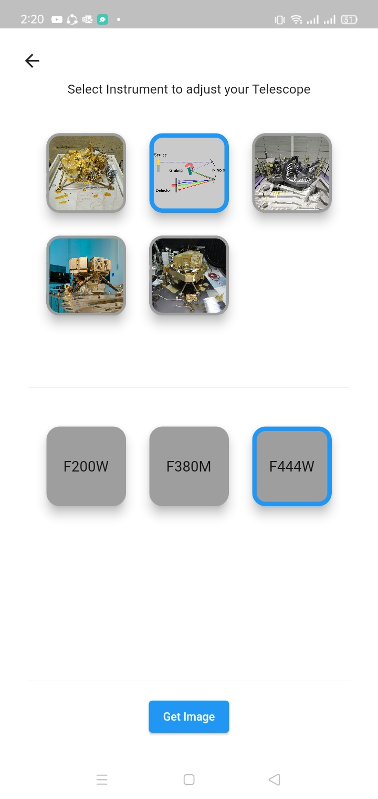  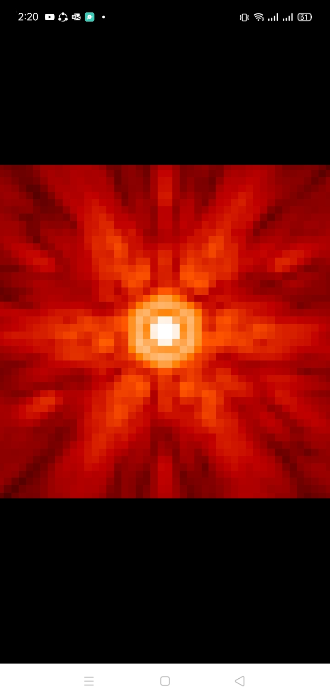

> ## Future Features:

- Users
- Adding scores
- Adding coins
- Connect leveling up with score
- Friends Challenges
- Adding more levels
- Adding more instruments and filters

---

> ## Technologies

- Mobile > Flutter
- Backend > Node JS

---

> ## Team

### **_ASME Stars_** | Nasa Space Apps Cairo 2022

- Zeyad Amr
- Mohamed Ismail
- Yousef Kadry
- Ahmed Emad
- Omar Saad
