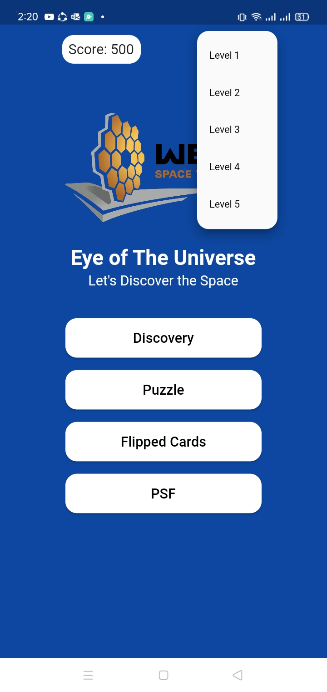

---

 

# Eye of The Universe

### This project is a solution for `Learning Through the Looking Glass` challenge which is to develop a game to help people learn about the `James Webb Space Telescope`’s amazing capabilities.

 

### Our game is divided into 4 stations: Discovery, Puzzle Game, Memory Game and PSF, and 5 levels, each level has a new image captured by James Web Telescope to be opened to the player to play with it in the stations.

 

> ## Discovery

- player discovers an object in space using James Webb Telescope and Hubble Telescope, comparing the capabilities of the two telescopes.

 
 

 
 

